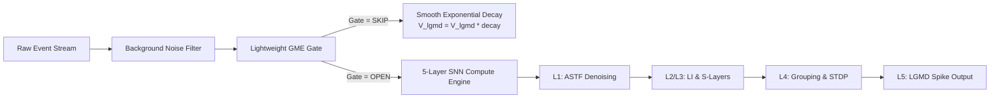

# SNN Looming Detector
## Early GME Gating Architecture & Temporal Memory Decay

<div style="padding-top: 3rem;">
  <span @click="$slidev.nav.next" style="padding: 0.75rem 1.5rem; border-radius: 9999px; background-color: #2563eb; color: #ffffff; font-weight: 600; cursor: pointer; transition: background-color 0.2s;">
    Explore Architecture <carbon:arrow-right style="display: inline; margin-left: 0.25rem;" />
  </span>
</div>

---

# Executive Summary

<v-clicks>

- **Core Challenge:** Running a full 5-layer Spiking Neural Network (SNN) on continuous event streams is **computationally expensive**.
- **The Solution:** A lightweight **Global Motion Estimation (GME) Early Gate** that filters out non-approaching events.
- **Dual-Path Strategy:** Bypasses velocity score drops ($Fuse = 0.000$) by relying on spatial expansion evidence ($E$).
- **State Preservation:** Smooth leaky decay on idle frames prevents "memory amnesia" and threshold spikes.

</v-clicks>

---

# System Pipeline Overview



---

# Dual-Path Gating Architecture

Avoids single-point gating failures by decoupling **velocity magnitude** from **spatial geometry**.

```python {all|3-8|10-15|17-18}
# Dual-Path Gating Logic Decision Matrix

# Path A (Spatial Expansion): Captures slow or distant looming where raw_score may drop to 0.0
path_a_spatial = (
    evidence >= 0.12
    and outward_fraction >= 0.60
    and confidence >= 0.10
)

# Path B (Velocity Spike): Captures rapid approach with high vector magnitudes
path_b_velocity = (
    raw_score >= 0.05
    and outward_fraction >= 0.50
    and confidence >= 0.10
)

# Gate opens if EITHER condition evaluates to True
raw_gate_open = path_a_spatial or path_b_velocity
```

---

# Interactive GME Gate Simulator

Test how `evidence` ($E$) and `raw_score` ($Fuse$) interact to trigger the downstream SNN.

<template>
  <div style="padding: 1.5rem; border: 1px solid #374151; border-radius: 0.75rem; background-color: #111827; box-shadow: 0 20px 25px -5px rgba(0, 0, 0, 0.1); margin: 1rem 0;">
    <div style="display: grid; grid-template-columns: repeat(2, minmax(0, 1fr)); gap: 1rem;">
      <div>
        <label style="font-size: 0.875rem; font-weight: 600; color: #d1d5db; display: block; margin-bottom: 0.25rem;">Evidence (E): {{ evidence.toFixed(3) }}</label>
        <input type="range" min="0" max="0.5" step="0.01" v-model.number="evidence" style="width: 100%;" />
      </div>
      <div>
        <label style="font-size: 0.875rem; font-weight: 600; color: #d1d5db; display: block; margin-bottom: 0.25rem;">Raw Score / Fuse: {{ rawScore.toFixed(3) }}</label>
        <input type="range" min="0" max="0.2" step="0.005" v-model.number="rawScore" style="width: 100%;" />
      </div>
      <div>
        <label style="font-size: 0.875rem; font-weight: 600; color: #d1d5db; display: block; margin-bottom: 0.25rem;">Outward Fraction: {{ (outward * 100).toFixed(0) }}%</label>
        <input type="range" min="0" max="1" step="0.05" v-model.number="outward" style="width: 100%;" />
      </div>
      <div>
        <label style="font-size: 0.875rem; font-weight: 600; color: #d1d5db; display: block; margin-bottom: 0.25rem;">Confidence: {{ confidence.toFixed(2) }}</label>
        <input type="range" min="0" max="1" step="0.05" v-model.number="confidence" style="width: 100%;" />
      </div>
    </div>
    
    <div style="padding-top: 1rem; border-top: 1px solid #1f2937; display: flex; align-items: center; justify-content: space-between; margin-top: 1rem;">
      <div style="font-size: 0.875rem; color: #f3f4f6;">
        <span style="font-weight: 600;">Path A (Spatial):</span> 
        <span :style="{ color: pathA ? '#4ade80' : '#f87171' }"> {{ pathA ? 'PASS' : 'FAIL' }}</span>
        <span style="padding: 0 0.75rem;">|</span>
        <span style="font-weight: 600;">Path B (Velocity):</span> 
        <span :style="{ color: pathB ? '#4ade80' : '#f87171' }"> {{ pathB ? 'PASS' : 'FAIL' }}</span>
      </div>
      <div style="padding: 0.5rem 1rem; border-radius: 0.5rem; font-weight: 700; font-size: 1.125rem;" :style="{ backgroundColor: gateOpen ? '#16a34a' : '#7f1d1d', color: gateOpen ? '#ffffff' : '#fca5a5' }">
        Gate Status: {{ gateOpen ? 'OPEN' : 'SKIP' }}
      </div>
    </div>
  </div>
</template>

<script setup>
import { ref, computed } from 'vue'

const evidence = ref(0.244)
const rawScore = ref(0.000)
const outward = ref(0.65)
const confidence = ref(0.15)

const pathA = computed(() => evidence.value >= 0.12 && outward.value >= 0.60 && confidence.value >= 0.10)
const pathB = computed(() => rawScore.value >= 0.05 && outward.value >= 0.50 && confidence.value >= 0.10)
const gateOpen = computed(() => pathA.value || pathB.value)
</script>

---

# Dynamic Hysteresis & Debouncing

Event-based processing time fluctuates based on **event density**, not fixed clock ticks.

<v-clicks>

- **Problem:** Fixed frame-count buffers either close too early during rapid movement or stay open too long during low activity.
- **Solution:** Dynamically adjust the `hold_frames` buffer based on throughput.

</v-clicks>

<div style="margin-top: 1rem;">

```python
def calculate_dynamic_hold(self, num_events: int) -> int:
    """Scales hold frames dynamically based on event throughput."""
    if num_events > 5000:
        return self.base_hold_frames + 2  # Fast/Dense: Hold 5 frames
    elif num_events < 200:
        return max(1, self.base_hold_frames - 2)  # Sparse: Hold 1 frame
    
    return self.base_hold_frames  # Nominal: Hold 3 frames
```

</div>

---

# Temporal Decay vs. Hard Reset

Why $V_{\text{lgmd}}$ applies leaky exponential decay on `SKIP` frames:

| Strategy | Behavior on Gate `SKIP` | Failure Mode |
| :--- | :--- | :--- |
| **Hard Zeroing** | $V_{\text{lgmd}} = 0.0$ | **Memory Amnesia:** Destroys accumulated charge, causing missed/delayed triggers. |
| **Frozen State** | $V_{\text{lgmd}}(t) = V_{\text{lgmd}}(t-1)$ | **Ghost Triggers:** Old charge persists, causing false positives on new unrelated motion. |
| **Leaky Decay** | $V_{\text{lgmd}}(t) = V_{\text{lgmd}}(t-1) \cdot \gamma$ | **Smooth Continuity:** Mimics cell membrane leakage; preserves short-term history safely. |

<div style="margin-top: 1.5rem; background-color: rgba(15, 23, 42, 0.6); padding: 1rem; border: 1px solid rgba(30, 58, 138, 0.5); border-radius: 0.5rem; font-size: 0.875rem;">
$$\text{Membrane Update Rule: } V_{\text{lgmd}}[t] = V_{\text{lgmd}}[t-1] \times \text{decay}$$
</div>

---
layout: center
class: text-center
---

# Summary & Key Takeaways

<div style="display: grid; grid-template-columns: repeat(3, minmax(0, 1fr)); gap: 1.5rem; margin: 2rem 0; text-align: left;">
  <div style="padding: 1rem; border: 1px solid #1f2937; border-radius: 0.5rem; background-color: rgba(17, 24, 39, 0.5);">
    <h3 style="color: #60a5fa; font-weight: 700; margin-bottom: 0.5rem;">1. Early Gating</h3>
    <p style="font-size: 0.75rem; color: #9ca3af;">Bypasses heavy SNN computations on non-looming frames to save execution time.</p>
  </div>
  <div style="padding: 1rem; border: 1px solid #1f2937; border-radius: 0.5rem; background-color: rgba(17, 24, 39, 0.5);">
    <h3 style="color: #60a5fa; font-weight: 700; margin-bottom: 0.5rem;">2. Dual-Path Logic</h3>
    <p style="font-size: 0.75rem; color: #9ca3af;">Maintains detection continuity even when flow magnitude drops to 0.0.</p>
  </div>
  <div style="padding: 1rem; border: 1px solid #1f2937; border-radius: 0.5rem; background-color: rgba(17, 24, 39, 0.5);">
    <h3 style="color: #60a5fa; font-weight: 700; margin-bottom: 0.5rem;">3. Leaky Decay</h3>
    <p style="font-size: 0.75rem; color: #9ca3af;">Preserves temporal memory across skipped frames without state corruption.</p>
  </div>
</div>

[GitHub Repository](https://github.com/) • **SNN Looming Detector Pipeline**
